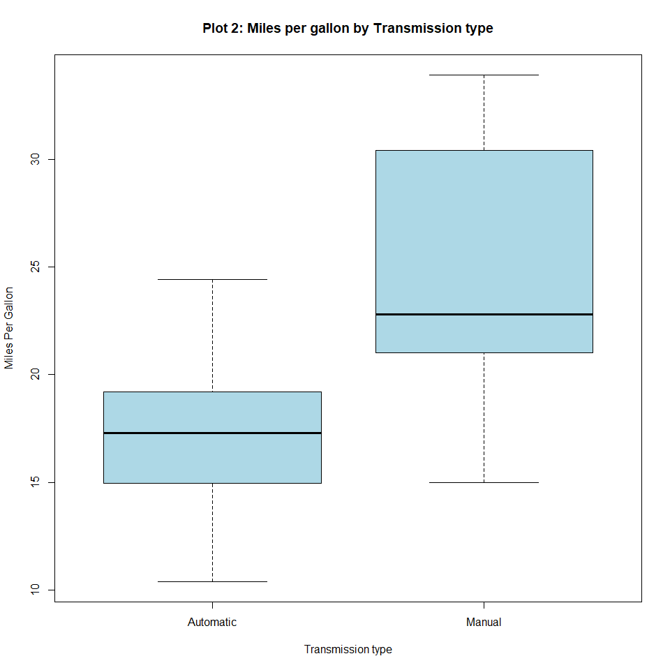

Automatic vs Manual Transmission for MPG
================
Avinash Dodda - July 2019

# Executive Summary

At Motor Trend magazine, we would like to answer the following questions
about motor cars:

  - Is an Automatic or Manual transmission **better** for MPG (miles per
    gallon)?

  - **Quantify** how different is the MPG between Automatic and Manual
    transmissions

To answer, we use `mtcars` data set and explore the relationship between
MPG and other variables.

# Exploratory Data Analysis

We load the `mtcars` data set and see that the data has 32 observations
of 11 variables. We convert the qualitative variables into factors.

``` r
data(mtcars)
mtcars[,c("cyl","vs","gear","carb")] <- lapply(mtcars[,c("cyl","vs","gear","carb")],
                                               function(x) factor(x))
mtcars$am <- factor(mtcars$am, labels = c("Automatic", "Manual"))
```

Next we look at correlation between `mpg` and other variables. We also
plot the scatter plots of the variables.

``` r
head(cor(mtcars[,c("mpg", "disp", "hp", "drat", "wt", "qsec")]), n=1)
```

    ##     mpg       disp         hp      drat         wt     qsec
    ## mpg   1 -0.8475514 -0.7761684 0.6811719 -0.8676594 0.418684

From above output and Plot 1 in Appendix, we observe that `mpg` is
strongly correlated with `cyl`, `disp`, `hp` and `wt`. From box plot
(Plot 2 in Appendix), Manual transmission seems better compared to
Automatic.

# Statistical Inference

To investigate the relation between `mpg` and `am` we will perform
t-test to test the hypothesis that there is significant difference
between MPG of Manual and Automatic transmission.

``` r
t.test(mpg ~ am, data = mtcars)
```

    ## 
    ##  Welch Two Sample t-test
    ## 
    ## data:  mpg by am
    ## t = -3.7671, df = 18.332, p-value = 0.001374
    ## alternative hypothesis: true difference in means is not equal to 0
    ## 95 percent confidence interval:
    ##  -11.280194  -3.209684
    ## sample estimates:
    ## mean in group Automatic    mean in group Manual 
    ##                17.14737                24.39231

From t-test, the p-value is 0.001374 \< 0.05 and mean MPG of Manual
transmission is higher than that of Automatic. So we can reject the null
hypothesis and conclude that ***accounting for all other factors*, on
average Manual transmission has better MPG compared to Automatic
transmission.**

# Regression Analysis

From the correlations it is evident that there are multiple variables
that account for the MPG differences. Hence we perform Multivariate
Linear Regression (MLR) analysis. We do MLR with all variables and use
step wise regression to automatically select the best model. We also
compare with single predictor model.

``` r
fit.all <- lm(mpg~.,data = mtcars)
fit.best <- step(fit.all, direction = "both")
```

``` r
summary(fit.best)
```

    ## 
    ## Call:
    ## lm(formula = mpg ~ cyl + hp + wt + am, data = mtcars)
    ## 
    ## Residuals:
    ##     Min      1Q  Median      3Q     Max 
    ## -3.9387 -1.2560 -0.4013  1.1253  5.0513 
    ## 
    ## Coefficients:
    ##             Estimate Std. Error t value Pr(>|t|)    
    ## (Intercept) 33.70832    2.60489  12.940 7.73e-13 ***
    ## cyl6        -3.03134    1.40728  -2.154  0.04068 *  
    ## cyl8        -2.16368    2.28425  -0.947  0.35225    
    ## hp          -0.03211    0.01369  -2.345  0.02693 *  
    ## wt          -2.49683    0.88559  -2.819  0.00908 ** 
    ## amManual     1.80921    1.39630   1.296  0.20646    
    ## ---
    ## Signif. codes:  0 '***' 0.001 '**' 0.01 '*' 0.05 '.' 0.1 ' ' 1
    ## 
    ## Residual standard error: 2.41 on 26 degrees of freedom
    ## Multiple R-squared:  0.8659, Adjusted R-squared:  0.8401 
    ## F-statistic: 33.57 on 5 and 26 DF,  p-value: 1.506e-10

The best model contains `cyl`, `wt`, `hp`, and `am` as predictors. As R
squared is 0.8659 implying 86.59% of the variance is explained by this
model. We now compare this model with only `am` as predictor using
`anova`.

``` r
anova(fit.best, lm(mpg ~ am, data = mtcars))[2, "Pr(>F)"]
```

    ## [1] 1.688435e-08

The P value is very low concluding that `cyl`, `wt` and `hp` contribute
significantly to the accuracy of the model.

# Residuals

Plot 3 in Appendix shows the residual plots. The Residuals vs Fitted
plot shows that the residuals are random. Residuals are normally
distributed as seen from Normal Q-Q plot. There is constant variance as
seen in Scale-Location plot. There are few leverage points as indicated
by Residuals vs Leverage plot.

# Conclusions

From the coefficients of best model, we conclude that MPG reduces by
3.03mpg and 2.16mpg with increase in cylinders from 4 to 6 and 8
respectively. Also MPG reduces by 0.03mpg and 2.50mpg with increase of
1hp and 1,000lb weight respectively.

**Finally *all else equal*, cars with Manual transmission are 1.81mpg
better than Automatic cars.**

# Appendix

## Scatter plot Matrix

``` r
library(car)
scatterplotMatrix(mtcars, regLine = list(col="red"), smooth = FALSE, 
                  main = "Plot 1: Scatter plot Matrix")
```


## Automatic vs Manual Box Plot

``` r
boxplot(mpg ~ am, data = mtcars, main = "Plot 2: Miles per gallon by Transmission type", 
    xlab = "Transmission type", ylab = "Miles Per Gallon", col = " light blue")
```



## Residual Plots

``` r
par(mfrow = c(2,2))
plot(fit.best)
mtext(expression(bold("Plot 3: Residual Plots")), side = 3, line = -2, outer = TRUE)
```


